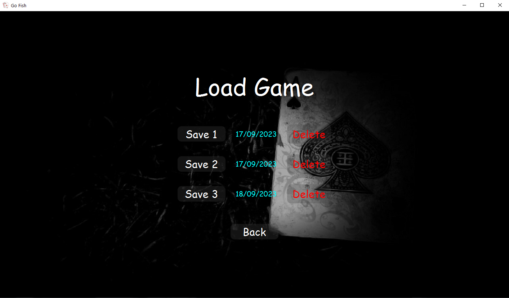
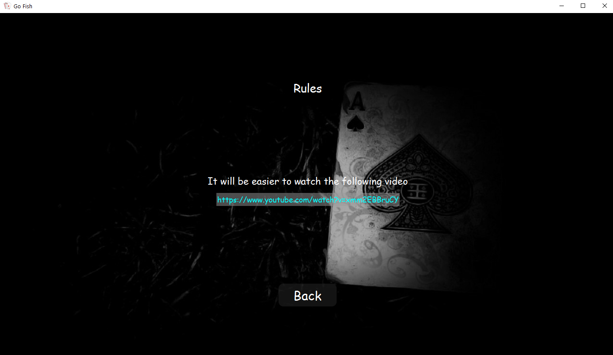

### This is a digital adaptation of the traditional card game ’Go Fish’. 

This game is designed for single-player, featuring <b> AI-controlled opponents </b> to provide an engaging gaming experience

#### I made this game as a solo project of my own using JavaFX and FXML.

## These are some snippets of the game:

### Opening Scene:

### Menus:

### Load Save and other options:

### Pre-Game:

### Mid-Game:

### Player Turn:

### Bot Turn:

### Post-Round:

### If the player chooses to end game:

